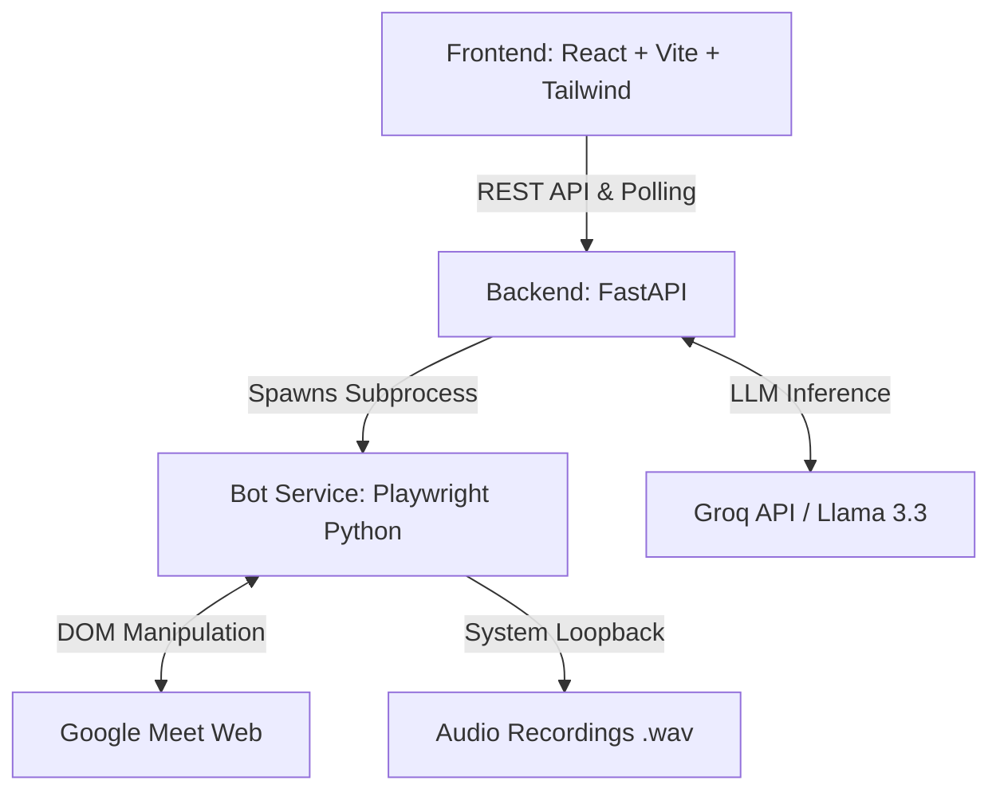

# MeetClone AI Agent - Project Milestones & Architecture

This document outlines the step-by-step evolution of the MeetClone AI Agent, detailing the implementation of Milestones 1 through 10.

---

## Architecture Overview

The system is built on a decoupled, three-tier architecture:

1. **Frontend:** A modern, glassmorphism UI built with React. It polls the backend for live chat updates, alerts, and bot status.
2. **Backend:** A FastAPI server that orchestrates the bot process, manages in-memory state, and connects to external LLMs (Groq).
3. **Bot Service:** A Python Playwright script that launches a persistent Chromium session, bypassing bot detection, and physically interacts with the Google Meet DOM.

---

## Milestone 1 & 2: Environment Setup & Automated Joining
**Goal:** Establish the foundation and get a bot into a Google Meet automatically.
*   **Action:** Initialized the FastAPI backend and React frontend. Set up a Python Playwright script (`join_meet.py`).
*   **Implementation:** Used `launch_persistent_context` to retain Google account logins. Passed custom flags (`--use-fake-ui-for-media-stream`, `--disable-blink-features=AutomationControlled`) to prevent Google from blocking the headless browser. The bot automatically navigates to the Meet URL, enters a specified name, and waits for entry.

## Milestone 3: Device Muting & Meeting Entry
**Goal:** Ensure the bot joins silently without causing feedback loops.
*   **Action:** Programmed the bot to mute its microphone and turn off its camera before requesting to join.
*   **Implementation:** The script waits for the specific `aria-label` buttons for the mic and camera and clicks them. If they fail to load quickly, it falls back to keyboard shortcuts (`Ctrl+D`, `Ctrl+E`). It then clicks "Ask to join" or "Join now" depending on the meeting state.

## Milestone 4 & 5: Live Chat Monitoring & Dashboard Streaming
**Goal:** Read the meeting chat in real-time and display it in the custom UI.
*   **Action:** The bot opens the chat sidebar and continuously scrapes new messages.
*   **Implementation:** The bot loops through DOM elements matching `[class*="message"]` or `[data-message-id]`. It extracts the sender, message body, and timestamp. These are written to `stdout` as `CHAT_MESSAGE: sender | message | time`. The FastAPI backend parses this stdout stream, stores it in memory, and the React frontend polls `GET /bot/{id}/chat` to display a live feed.

## Milestone 6: Name Mention Alerts
**Goal:** Notify the user when they are addressed in the meeting.
*   **Action:** Added a dynamic alert system.
*   **Implementation:** The user defines their name (e.g., "Vinayak") in the deploy form. The backend continuously checks incoming chat messages. If `user_name.lower() in message.lower()` is true, it creates an alert object. The frontend polls `GET /bot/{id}/alerts` and displays a highly visible "Name Mention Alert" card on the UI.

## Milestone 7: Remote Chat Reply (Manual)
**Goal:** Allow the user to type in the dashboard and have the bot send it to the Meet chat.
*   **Action:** Added an outbox queue.
*   **Implementation:** The frontend sends a `POST` request with a message. The backend queues it. The Playwright bot periodically queries `GET /bot/{id}/pending-messages`. When it finds a message, it uses Playwright to locate the chat input box, types the text, presses "Enter", and reports back.

## Milestone 8: Smart AI Auto-Reply System
**Goal:** Enable the bot to reply to specific questions autonomously.
*   **Action:** Implemented a two-tier LLM-powered response system.
*   **Implementation:** 
    *   **Context:** The user provides an instruction (e.g., "If asked about the deadline, say Friday") and a persona context ("I am Vinayak, a student").
    *   **Tier 1 (Local Filter):** The backend quickly checks if the message mentions the user's name or overlaps with keywords in the instruction. If not, it drops the message to save API costs.
    *   **Tier 2 (Groq LLM):** If relevant, the message, instruction, and user context are sent to `llama-3.1-8b-instant`. The LLM returns a structured JSON deciding `should_reply: true/false` and generating the exact response text.

## Milestone 9: AI Meeting Summary
**Goal:** Generate a structured, actionable report after the meeting.
*   **Action:** Integrated `llama-3.3-70b-versatile` via the Groq API.
*   **Implementation:** The user clicks "Generate AI Summary" on the dashboard. The backend formats the entire captured chat history into a transcript. The LLM is prompted to strictly return a complex JSON object containing:
    *   Overall Summary
    *   Key Points, Decisions, Action Items, Deadlines
    *   Participant-wise Breakdown (messages sent, questions asked, contributions per person)
    *   Important Messages highlighted with reasons.
    *   The frontend dynamically renders this JSON into a premium, color-coded dashboard.

## Milestone 10: Audio Recording & Playback
**Goal:** Capture the actual meeting audio for later review or transcription.
*   **Action:** Implemented local system loopback recording.
*   **Implementation:** Using the Python `soundcard` and `soundfile` libraries, the bot starts an isolated background thread the moment it joins the meeting. It records the Windows WASAPI loopback (what the speakers output) and saves it as `.wav` files. To prevent massive file sizes during long meetings, the audio is automatically chunked every 5 minutes. The backend serves these static files, and the frontend displays an HTML5 audio player allowing instant playback of the meeting segments.

---

## Milestone 10.5: Audio Preprocessing Pipeline
**Goal:** Standardize and clean audio before sending it to AI transcription services.
*   **Action:** Built a dedicated audio processing module using `ffmpeg`.
*   **Implementation:** Every recorded chunk is automatically processed to convert it to **Mono, 16kHz, 16-bit PCM WAV** (the gold standard for STT). I implemented **EBU R128 loudness normalization** to balance the volume of quiet speakers and an **80Hz highpass filter** to remove low-frequency electrical hum and background noise.

## Milestone 11: Audio Transcription & Intelligence
**Goal:** Convert spoken meeting audio into English text and detect name mentions.
*   **Action:** Integrated **Groq Whisper Large V3** with a translation-first pipeline.
*   **Implementation:** 
    *   **Translation:** Spoken Telugu, Hindi, or any language is automatically translated into English text. 
    *   **Timestamping:** The transcript is generated with accurate `[MM:SS]` offsets.
    *   **Audio Name Alerts:** The system scans the generated transcript for the user's defined name and triggers a real-time dashboard alert if they were mentioned in speech.
    *   **Summary Integration:** The AI Meeting Summary now consumes both typed chat history AND spoken audio transcripts to produce a 100% complete meeting report.

---

### Current Status
The project is currently at **Milestone 11**. It is a fully functional AI Meeting Agent capable of joining meetings, chatting, replying, recording, cleaning audio, transcribing speech, and generating comprehensive intelligence reports.

---

### Required Environment Variables
- `GROQ_API_KEY`: Powering AI Chat Replies, Transcription, and Meeting Summaries.
- `FFMPEG`: Required for audio cleaning (Auto-detected if installed via winget).
