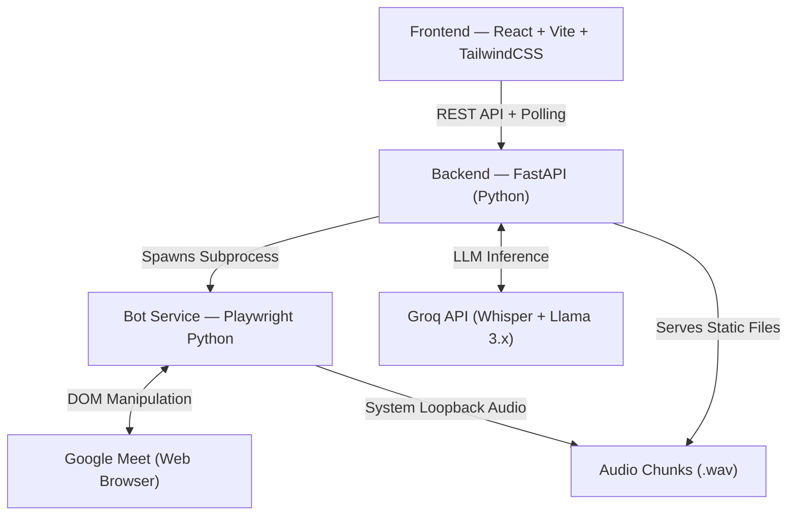

# 🤖 MeetClone — Google Meet AI Agent: Project Overview

## What Is This?

**MeetClone** is a self-hosted AI agent that autonomously joins Google Meet sessions. It acts as an invisible co-pilot — recording audio, scraping chat, auto-replying, transcribing speech, capturing presentation slides, and generating structured AI summaries.  
Current status: **Milestone 14** (out of a planned roadmap).

---

## Architecture — 3-Tier Decoupled System



| Layer | Tech | Role |
|---|---|---|
| **Frontend** | React + Vite + TailwindCSS | Dashboard UI, live polling, controls |
| **Backend** | FastAPI (Python) | Orchestration, state management, LLM calls |
| **Bot Service** | Playwright + Python | Browser automation inside Google Meet |
| **AI Engine** | Groq API | Whisper-v3 (transcription), Llama-3.3 (summaries, auto-reply), Llama-3.2-vision (slides) |

---

## Directory Map

```
Google_Meet_Agent/
├── backend/                  ← FastAPI server
│   ├── app/
│   │   ├── main.py           ← App entry point, mounts routes + static files
│   │   ├── core/config.py    ← Path/env config
│   │   ├── storage/
│   │   │   └── in_memory_store.py  ← All shared state (dicts/sets, in-RAM)
│   │   ├── api/
│   │   │   ├── router.py     ← Aggregates all route modules
│   │   │   └── routes/
│   │   │       ├── bot_routes.py        ← Deploy / stop bot
│   │   │       ├── chat_routes.py       ← Get chat + send message
│   │   │       ├── alert_routes.py      ← Name mention alerts
│   │   │       ├── audio_routes.py      ← Audio chunk listing + playback
│   │   │       ├── summary_routes.py    ← AI summary generation
│   │   │       ├── transcript_routes.py ← Audio transcript access
│   │   │       ├── visual_routes.py     ← Screenshot listing + vision extraction
│   │   │       └── memory_routes.py     ← Past meeting memory (JSON on disk)
│   │   └── services/
│   │       ├── bot_runtime_service.py   ← Spawns/manages bot subprocess + stdout parsing
│   │       ├── summary_service.py       ← Groq Llama for summaries + auto-reply
│   │       ├── transcription_service.py ← Groq Whisper transcription
│   │       ├── audio_preprocess_service.py ← FFmpeg audio cleaning
│   │       ├── vision_service.py        ← Groq Vision (slide extraction)
│   │       └── meeting_memory_service.py← Persists meeting data to JSON files
│
├── bot-service/              ← Playwright automation script
│   ├── join_meet.py          ← Main bot orchestrator (runs as subprocess)
│   ├── audio_recorder.py     ← WASAPI loopback audio recording (soundcard)
│   ├── message_sender.py     ← Polls backend + sends outbound messages via Playwright
│   ├── image_utils.py        ← MSE-based screenshot deduplication (Pillow/numpy)
│   ├── status_logger.py      ← Writes STATUS:/CHAT_MESSAGE:/VISUAL:/ERROR: to stdout
│   └── config.py             ← Bot-level constants (selectors, intervals, paths)
│
├── frontend/                 ← React dashboard
│   └── src/
│       ├── App.tsx           ← Root: page routing (home/deploy/active/memory)
│       ├── hooks/
│       │   └── useMeetingSession.ts  ← Central state hook (polling, deploy, stop)
│       ├── components/
│       │   ├── layout/Sidebar       ← Navigation sidebar
│       │   ├── dashboard/HeroSection ← Home page
│       │   ├── meeting/
│       │   │   ├── DeployForm       ← Configure + launch bot
│       │   │   └── ActiveMeetingDashboard ← Live status cards
│       │   ├── outputs/OutputTabs   ← Chat, Alerts, Transcript, Audio, Summary, Slides
│       │   └── memory/MeetingMemory ← Browse past meetings
│       └── services/
│           ├── api.ts         ← Base Axios config
│           ├── botApi.ts      ← Bot endpoints
│           └── memoryApi.ts   ← Meeting memory endpoints
│
├── meeting_memory/           ← JSON files of past meetings (persisted on disk)
├── recordings/               ← .wav audio chunks + /screenshots/ folder
├── docker-compose.yml        ← Postgres + backend + bot-service + frontend
└── PROJECT_MILESTONES.md     ← Detailed milestone history
```

---

## Core Data Flow

### 1. Deploying a Bot
1. User fills **DeployForm** (Meet link, bot name, user name, auto-reply instructions)
2. Frontend `POST /bot/deploy` → Backend creates a session entry in `in_memory_store`
3. Backend calls `run_bot_process()` — spawns `join_meet.py` as a **subprocess**
4. Bot stdout streams back `STATUS:`, `CHAT_MESSAGE:`, `VISUAL:`, `ERROR:` prefixed lines
5. Backend parses these lines in a thread and updates in-memory state

### 2. Live Monitoring (Frontend Polling)
- Frontend polls every ~3s: `/bot/{id}/chat`, `/bot/{id}/alerts`, `/bot/{id}/status`
- Audio chunks available at `/bot/{id}/audio`
- Slides available at `/bot/{id}/visual`

### 3. Audio Pipeline
```
soundcard (WASAPI loopback) → .wav chunk every 5 min
  → ffmpeg preprocessing (mono, 16kHz, EBU R128 normalization, 80Hz HPF)
  → Groq Whisper-v3 (transcription/translation to English)
  → stored in bot_transcripts[]
  → Name mention scan → alert if found
```

### 4. AI Summary
- Triggered manually: `POST /bot/{id}/summary`
- Combines: full chat history + audio transcripts
- Groq Llama-3.3-70b returns structured JSON:
  - Overall Summary, Key Points, Decisions, Action Items, Deadlines
  - Per-participant breakdown

### 5. Presentation Slide Capture
- Bot polls DOM for `aria-label*="presentation"` indicators
- Screenshot taken at most every 15s (configurable)
- MSE diff-check vs. previous screenshot — only saves if visually different
- Vision extraction: Groq `llama-3.2-11b-vision-preview` extracts structured JSON from top-15 slides

### 6. Auto-Reply
- Two-tier system:
  1. **Keyword filter** (fast, local) — checks if message has instruction keywords or user name
  2. **Groq Llama-3.1-8b-instant** (LLM) — returns `{should_reply, response}` JSON
- If reply approved → queued to `bot_outbox` → Playwright bot types & sends it

### 7. Meeting Memory
- On bot process exit → `meeting_memory_service.save_meeting()` persists full session JSON
- Stored in `meeting_memory/` folder on disk
- Accessible via `GET /memory` in the UI

---

## Key Technical Highlights

| Feature | Implementation |
|---|---|
| Bot detection bypass | `--disable-blink-features=AutomationControlled` + persistent Chrome profile |
| Audio recording | Python `soundcard` (WASAPI loopback) in background thread, 5-min chunks |
| Audio cleaning | FFmpeg: mono 16kHz, EBU R128 loudness, 80Hz highpass filter |
| Transcription | Groq Whisper-v3 with translation pipeline |
| Screenshot dedup | Pillow + numpy MSE comparison |
| State management | All in-RAM Python dicts (`in_memory_store.py`) — no database for runtime |
| IPC | Bot → Backend via **stdout line protocol** (`STATUS:`, `CHAT_MESSAGE:`, `VISUAL:`, `ERROR:`) |
| Persistence | Meeting summaries saved as JSON files to `meeting_memory/` |
| Docker | Full `docker-compose.yml` with Postgres (for future use), backend, bot-service, frontend |

---

## Environment & Dependencies

- **Python 3.11+**: FastAPI, Playwright, soundcard, soundfile, Groq SDK, ffmpeg-python
- **Node.js 18+**: React, Vite, Framer Motion, Lucide React, TailwindCSS
- **FFmpeg**: Auto-detected (Windows: `winget install Gyan.FFmpeg`)
- **Groq API Key**: Required (`GROQ_API_KEY` in `backend/.env`)

---

## Running the Project

```bash
# Backend
cd backend
venv\Scripts\activate
uvicorn app.main:app --reload   # http://localhost:8000

# Frontend
cd frontend
npm run dev                     # http://localhost:5173

# Bot (spawned automatically by backend, but can run standalone)
cd bot-service
python join_meet.py <meet_link> <bot_name> <bot_id> <backend_url>
```
